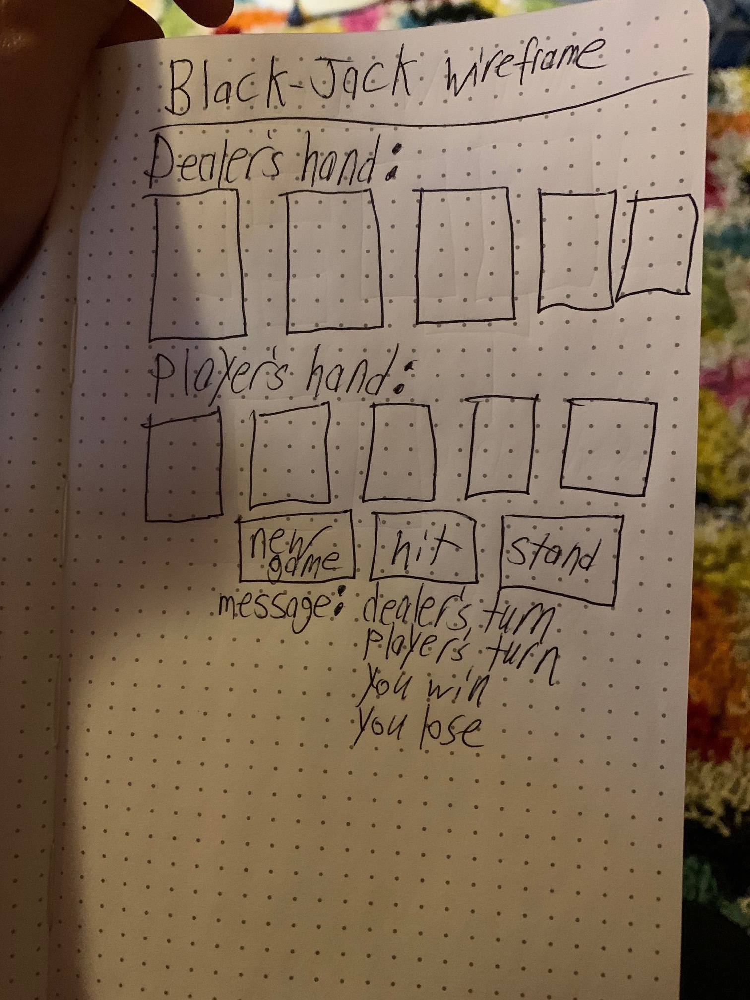

# Black-jack
Project 1 Blackjack game

Pseudocode for Blackjack:

1.Create the HTML: (h2 text: dealers hand, h2 text: players hand.  Create blank spaces for cards made from divs, id= “player 1”, “player 2”, up to 5. div id =“dealer 1”, “dealer 2” , up to 5. Make buttons for hit, stand, new game. Make a message div that can be changed with innerhtml).

2.Create a deck of cards with JavaScript: let suits = [], values = [], card = {}, deck={}, ).
Declare constants: card suits and non numeric’s ie; card.clubs , card.hearts, card.diamonds, card.spades. card.king, card.queen, card.jack, card.ace.

3.Create logic/functions in JavaScript for new game, hit, stand, win, lose, switch turns, deck shuffle, message, removeCard once played
Create and Cache DOM elements: cache players cards, cache used cards, create card images.

